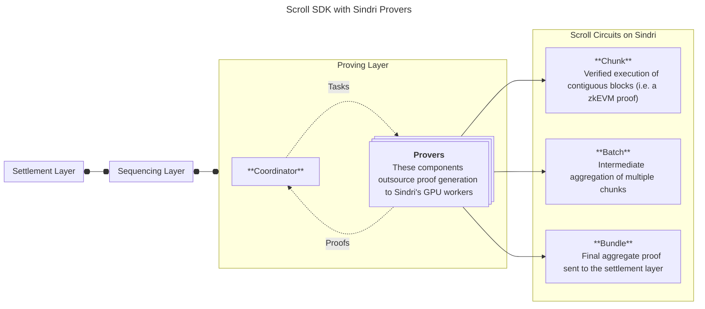

# Sindri Provers for Scroll SDK


#### [Sindri Sign Up](https://sindri.app/signup) | [Scroll SDK Docs](https://scroll-sdk-init.docs.scroll.xyz/en/sdk/) | [Getting Started](#getting-started) | [Development](#development)

Sindri provides automated ZK proving infrastructure, empowering hundreds of teams — including leading Layer 2s and rollups — to launch in minutes instead of months.
Through our API, developers can seamlessly integrate verifiable computation, reducing time to market, cutting costs, and scaling faster.
Sindri makes zero-knowledge infrastructure simple and accessible, facilitating automation across every layer of the ZK app deployment stack.

This repository hosts the images and Helm charts designed to perform proof generation for a Scroll SDK chain.
The following diagram depicts how the Scroll SDK components work together when you use Sindri as a prover.


For more information about the Sindri platform, please check out [sindri.app](https://sindri.app/).
The next section will show you how to launch a local Scroll SDK devnet with provers running on Sindri.
For production deployments, please consult the official [Scroll SDK documentation](https://scroll-sdk-init.docs.scroll.xyz/en/sdk/guides/production-deployment/).

# Getting Started

While this section primarily reiterates [Scroll's Devnet Guide](https://scroll-sdk-init.docs.scroll.xyz/en/sdk/guides/devnet-deployment/), it includes adjustments specifically for Ubuntu environments.

### Prerequisites

You will need to obtain an API key to use Sindri.
If you have not already created an account, follow the sign up link posted at the top left of this README.
After logging into the [Sindri front-end](https://sindri.app/login), you can create and manage your API Keys within the [API Keys Settings page](https://sindri.app/z/me/page/settings/api-keys).

You should also install `docker`, `kubectl`, `minikube`, `helm`, `node`, and `scrollsdk` as instructed by the official [Scroll SDK documentation](https://scroll-sdk-init.docs.scroll.xyz/en/sdk/guides/devnet-deployment/#prerequisites).

At this point, you should start `minikube` via
```
minikube start --driver=docker
```

### Obtaining and Configuring Charts

There is no need to work in this repository, as the guide will be utilizing publicly hosted images and Helm charts.
However, you will need to clone the Scroll SDK repo and navigate to the `devnet/` directory to access some helper scripts.
```bash
git clone git@github.com:scroll-tech/scroll-sdk.git
cd scroll-sdk/devnet
```

Next we will manually pull and extract the chart for the latest version of Scroll SDK.
```bash
make bootstrap
```
> ⚠️ **Encountering Permission Issues?**<br>
> If you are given any prompts during the execution of the bootstrap command, then there is likely a root vs. user mismatch between configuration shell scripts and the downloaded files.
> You can solve this by exiting the bootstrap process with `ctrl+c` and running the `config` command separately with `sudo make config`.


### Installing the Helm Chart

In this step, we will launch the sequencing layer, the coordinator, and various visibility services.
Because provers require manual configuration, we will start those separately in a later section.
Note that the standard devnet settings do not include any proving layer services, so you will need to add the following two lines to the end of the `install` command in `scroll-sdk/devnet/Makefile`.
```bash
    --set coordinator-api.enabled=true \
    --set coordinator-cron.enabled=true
```
After that adjustment, enter `make install` in your terminal to start the chain.
You can monitor the progress and health of all the services via the command `kubectl get pods`.

> 🕒 **Waiting on the coordinator?**<br>
> An essential functionality of the coordinator is the validation of proofs that are returned from a prover.
> For this reason, there are two initial pods (`assets-download` and `parameter-download`) which must pull zkEVM circuit artifact files before the final `coordinator-api` pod starts.
> You can watch the progress of the first pod with `kubectl logs coordinator-api-0 -c assets-download`.
> Similarly, you can watch the progress of the trusted setup download via `kubectl logs coordinator-api-0 -c parameter-download`.

### Accessing Services Locally

Your chain is now running, but all of the pods are insulated inside of the minikube cluster.
To interact with the chain, we need to first enable kubectl to port-forward. 
The following command allows `kubectl` to bind to ports 80 and 443 (without running the application as root): 
```bash
sudo setcap CAP_NET_BIND_SERVICE=+eip $(which kubectl)
```

Next, we want to add mappings between the Scroll SDK services and the VM address to our local DNS resolver.
After looking up the address (by calling `kubectl get ingress` for example), copy that into the codeblock below.
Then, you should append this to the end of your `/etc/hosts/` file.
```bash
<Your Remote VM IP Address> l1-devnet.scrollsdk
<Your Remote VM IP Address> bridge-history.scrollsdk
<Your Remote VM IP Address> frontends.scrollsdk
<Your Remote VM IP Address> grafana.scrollsdk
<Your Remote VM IP Address> l1-devnet-explorer.scrollsdk
<Your Remote VM IP Address> l2-rpc.scrollsdk
<Your Remote VM IP Address> blockscout.scrollsdk
<Your Remote VM IP Address> bridge-history-api.scrollsdk
```

Finally, you can begin port forwarding via the following command.
```bash
kubectl port-forward -n ingress-nginx  --address 0.0.0.0 service/ingress-nginx-controller 80:80 443:443
```
You should be able to access the endpoints via your browser.
[This section](https://scroll-sdk-init.docs.scroll.xyz/en/sdk/guides/devnet-deployment/#web-uis) of the Scroll SDK documentation provides an explanation of all the available dashboards.

### 🚀 Launching Sindri Provers

...


> **Starting and Stopping Your Devnet**<br>
> You can stop all services with `make delete` and restart with `make install` (assuming you are still in the `scroll-sdk/devnet` directory).
> However, you may need to remove the volumes created inside of minikube.
> To do this:
> 1. list your volumes with `kubectl get pvc`
> 2. delete them with `kubectl delete pvc <pvc-name> --force`

# Internal Development

This section is intended for Sindri developers.

### Local Build

To run the prover directly in the terminal, first, create your `config.json` file from a template
```bash
cp example.config.json config.json
```
Now edit the config to supply your Sindri API key.

Compile and launch the prover via
```bash
cargo run --release
```


### Docker Build

You can build the docker image via
```bash
docker build -t sindri-prover -f docker/Dockerfile .
```
You can then use the example docker compose configuration to launch the container via the following command.  Make sure you follow the initial part of the previous section to get your own `config.json` file.
```bash
docker compose --profile=prover up -d
```
