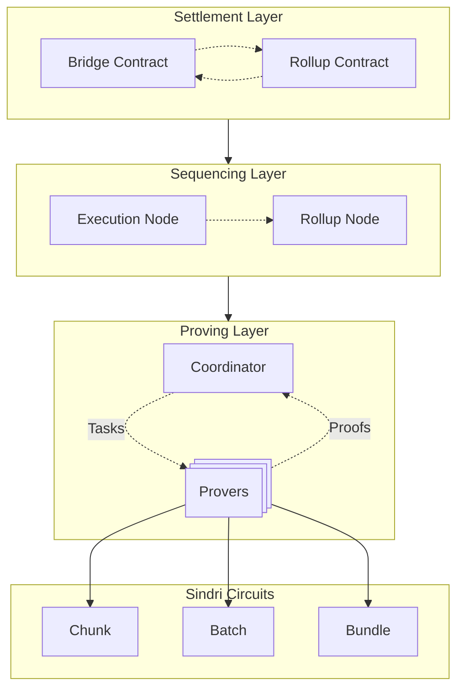

# Sindri Provers for Scroll SDK


#### [Sindri Sign Up](https://sindri.app/signup) | [Scroll SDK Docs](https://scroll-sdk-init.docs.scroll.xyz/en/sdk/) | [Getting Started](#getting-started) | [Development](#development)

Sindri provides automated ZK proving infrastructure, empowering hundreds of teams — including leading Layer 2s and rollups — to launch in minutes instead of months.
Through our API, developers can seamlessly integrate verifiable computation, reducing time to market, cutting costs, and scaling faster.
Sindri makes zero-knowledge infrastructure simple and accessible, facilitating automation across every layer of the ZK app deployment stack.

This repository hosts the images and Helm charts designed to perform proof generation for a Scroll SDK chain.
The following diagram depicts how the Scroll SDK components work together when you use Sindri as a prover.


For more information about the Sindri platform, please check out [sindri.app](https://sindri.app/).
The next section will show you how to launch a local Scroll SDK devnet with provers running on Sindri.
For production deployments, please consult the official [Scroll SDK documentation](https://scroll-sdk-init.docs.scroll.xyz/en/sdk/guides/production-deployment/).

# Getting Started

1. Obtain a Sindri API key.

After logging into the [Sindri front-end](https://sindri.app/login), you can create and manage your API Keys within the [API Keys Settings page](https://sindri.app/z/me/page/settings/api-keys).

2. 

# Internal Development

### Local Build

To run the prover directly in the terminal, first, create your `config.json` file from a template
```bash
cp example.config.json config.json
```
Now edit the config to supply your Sindri API key.

Compile and launch the prover via
```bash
cargo run --release
```


### Docker Build

You can build the docker image via
```bash
docker build -t sindri-prover -f docker/Dockerfile .
```
You can then use the example docker compose configuration to launch the container via the following command.  Make sure you follow the initial part of the previous section to get your own `config.json` file.
```bash
docker compose --profile=prover up -d
```
